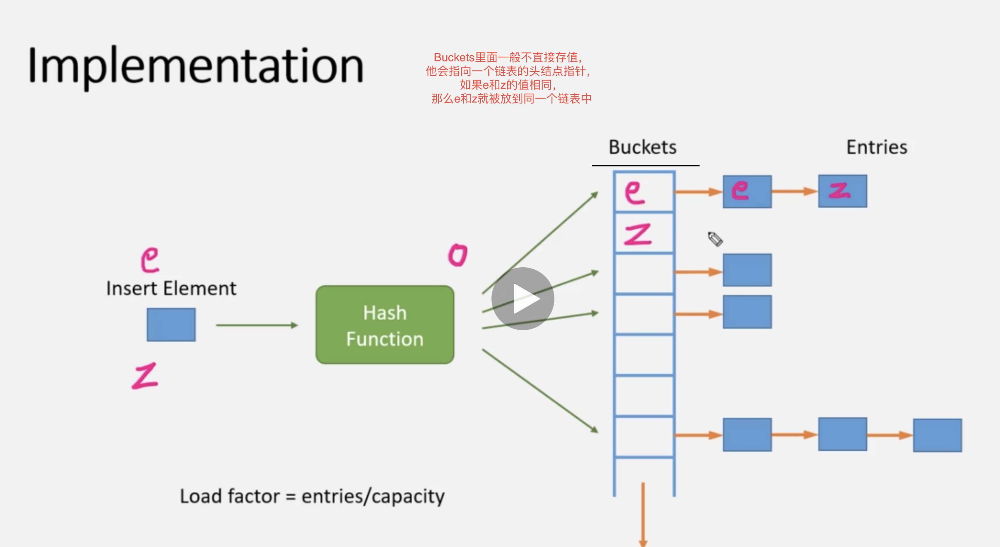
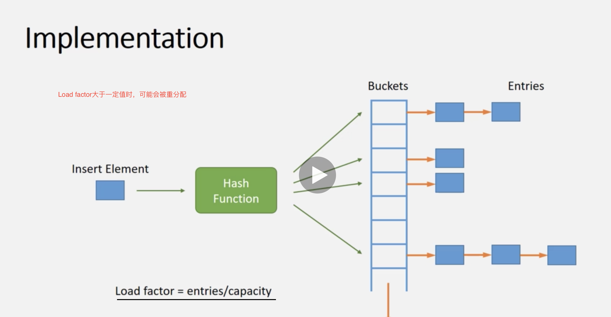

# Unordered Conatiners C++ 11-1
## 实现
 不同的key可能具有相同的Hash值，具有相同的hash值这种情况叫做Hash冲突

 ## Hash 桶
  Buckets里面一般不直接存值，他会指向一个链表的头节点指针，如果e和z的值相同，那么e和z就被放在同一个链表中。
  

## Hash 桶2
  Load Factor 大于一定值时，可能会被重新分配。
  加载因子就是Hashmap的桶的个数/总元素数。如下图的加载因子是1。 
  7/7 = 1
  加载因子一般是0.75，效果比较好。
 

