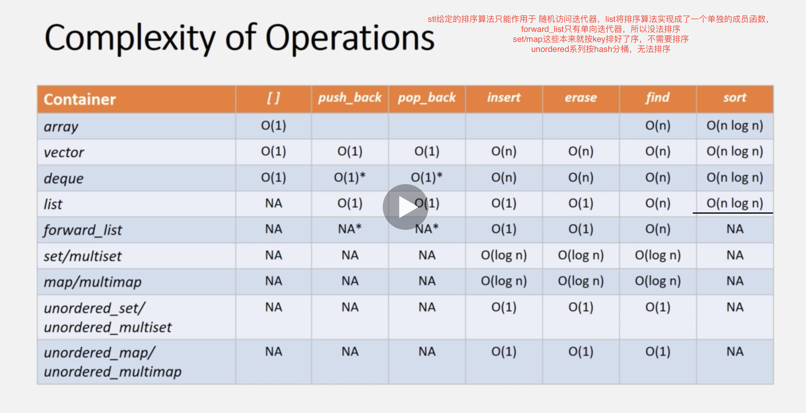

# 时间复杂度

## 各种容器操作的时间复杂度
  std::set, multiset, map, multimap insert, erase花费log(n)时间，因为内部实现是二叉树实现。

  std::unordered_set, unordered_map insert, erase花费O(1)时间, 但是前提是load_factor必须较小才行。

  Unordered系列内部使用hash实现。

 

 ## 排序注意事项
    STL给定的排序算法只能用于随机访问迭代器，list将排序算法实现成了一个单独的成员函数

    forward_list只有单向迭代器，所以没法排序

    std::set, map这些本来就按key排好了序，所以不需要排序。

    unordered系列按hash分桶，无法排序

## 总结

    1. vector被用作随机访问，一般不用于插入，删除
    
    2. 当元素需要双端插入和删除时，使用std::deque

    3. 如果需要频繁的插入和删除，请使用list
        在内存限制的场景，使用forward_list

    4. 如果查找功能非常重要，请使用关联容器

    5. 如果元素不需要被排序，一般使用unordered_map,否则使用set/map。只有需要排序，才使用set/map。 

